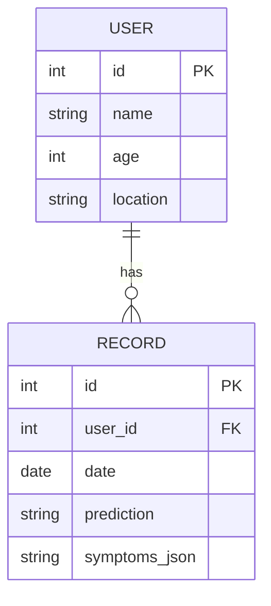
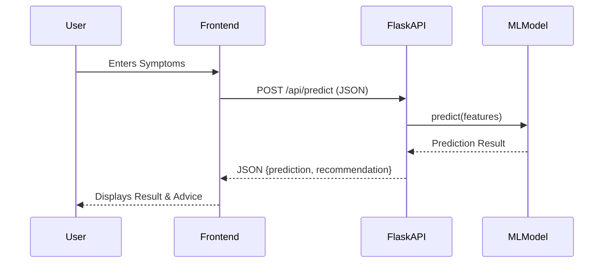

# Project Architecture & Diagrams

## 1. System Architecture
The application follows a standard Model-View-Controller (MVC) pattern adapted for Flask.

- **Client (View)**: HTML/CSS/JS running in the user's browser. Handles user input and displays results.
- **Server (Controller)**: Flask App (`app.py`). Handles routing, API requests, and serves templates.
- **Model**: Scikit-learn Model (`disease_model.pkl`). Performs inference on symptom data.

## 2. ER Diagram (Entity Relationship)
*Note: Currently using in-memory/synthetic data. Future SQLite implementation:*



## 3. Data Flow Diagram (DFD) - Prediction


## 4. Use Case Diagram
```mermaid
usecaseDiagram
    actor Woman as "Tribal Woman"
    
    package "Health App" {
        usecase "Check Symptoms" as UC1
        usecase "View Dashboard" as UC2
        usecase "Chat with Bot" as UC3
        usecase "Call Emergency" as UC4
    }
    
    Woman --> UC1
    Woman --> UC2
    Woman --> UC3
    Woman --> UC4
```
